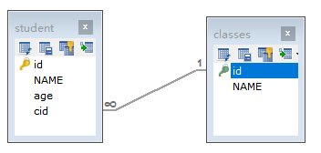
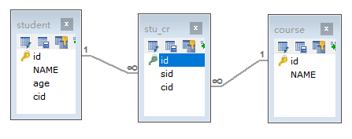

### 一.Mybatis注解开发单表操作

#### 1.1 MyBatis的常用注解 

这几年来注解开发越来越流行，Mybatis也可以使用注解开发方式，这样我们就可以减少编写Mapper

映射文件了。我们先围绕一些基本的CRUD来学习，再学习复杂映射多表操作。

@Insert：实现新增

@Update：实现更新

@Delete：实现删除

@Select：实现查询

@Result：实现结果集封装

@Results：可以与@Result 一起使用，封装多个结果集

@One：实现一对一结果集封装

@Many：实现一对多结果集封装

#### 1.2 MyBatis的增删改查 

我们完成简单的student表的增删改查的操作

* 步骤一:创建mapper接口

  ~~~java
  public interface StudentMapper {
      //查询全部
      @Select("SELECT * FROM student")
      public abstract List<Student> selectAll();
  
      //新增操作
      @Insert("INSERT INTO student VALUES (#{id},#{name},#{age})")
      public abstract Integer insert(Student stu);
  
      //修改操作
      @Update("UPDATE student SET name=#{name},age=#{age} WHERE id=#{id}")
      public abstract Integer update(Student stu);
  
      //删除操作
      @Delete("DELETE FROM student WHERE id=#{id}")
      public abstract Integer delete(Integer id);
  }
  
  ~~~

* 步骤二：测试类

  ~~~java
  public class Test01 {
      @Test
      public void selectAll() throws Exception{
          //1.加载核心配置文件
          InputStream is = Resources.getResourceAsStream("MyBatisConfig.xml");
  
          //2.获取SqlSession工厂对象
          SqlSessionFactory sqlSessionFactory = new SqlSessionFactoryBuilder().build(is);
  
          //3.通过工厂对象获取SqlSession对象
          SqlSession sqlSession = sqlSessionFactory.openSession(true);
  
          //4.获取StudentMapper接口的实现类对象
          StudentMapper mapper = sqlSession.getMapper(StudentMapper.class);
  
          //5.调用实现类对象中的方法，接收结果
          List<Student> list = mapper.selectAll();
  
          //6.处理结果
          for (Student student : list) {
              System.out.println(student);
          }
  
          //7.释放资源
          sqlSession.close();
          is.close();
      }
  
      @Test
      public void insert() throws Exception{
          //1.加载核心配置文件
          InputStream is = Resources.getResourceAsStream("MyBatisConfig.xml");
  
          //2.获取SqlSession工厂对象
          SqlSessionFactory sqlSessionFactory = new SqlSessionFactoryBuilder().build(is);
  
          //3.通过工厂对象获取SqlSession对象
          SqlSession sqlSession = sqlSessionFactory.openSession(true);
  
          //4.获取StudentMapper接口的实现类对象
          StudentMapper mapper = sqlSession.getMapper(StudentMapper.class);
  
          //5.调用实现类对象中的方法，接收结果
          Student stu = new Student(4,"赵六",26);
          Integer result = mapper.insert(stu);
  
          //6.处理结果
          System.out.println(result);
  
          //7.释放资源
          sqlSession.close();
          is.close();
      }
  
      @Test
      public void update() throws Exception{
          //1.加载核心配置文件
          InputStream is = Resources.getResourceAsStream("MyBatisConfig.xml");
  
          //2.获取SqlSession工厂对象
          SqlSessionFactory sqlSessionFactory = new SqlSessionFactoryBuilder().build(is);
  
          //3.通过工厂对象获取SqlSession对象
          SqlSession sqlSession = sqlSessionFactory.openSession(true);
  
          //4.获取StudentMapper接口的实现类对象
          StudentMapper mapper = sqlSession.getMapper(StudentMapper.class);
  
          //5.调用实现类对象中的方法，接收结果
          Student stu = new Student(4,"赵六",36);
          Integer result = mapper.update(stu);
  
          //6.处理结果
          System.out.println(result);
  
          //7.释放资源
          sqlSession.close();
          is.close();
      }
  
      @Test
      public void delete() throws Exception{
          //1.加载核心配置文件
          InputStream is = Resources.getResourceAsStream("MyBatisConfig.xml");
  
          //2.获取SqlSession工厂对象
          SqlSessionFactory sqlSessionFactory = new SqlSessionFactoryBuilder().build(is);
  
          //3.通过工厂对象获取SqlSession对象
          SqlSession sqlSession = sqlSessionFactory.openSession(true);
  
          //4.获取StudentMapper接口的实现类对象
          StudentMapper mapper = sqlSession.getMapper(StudentMapper.class);
  
          //5.调用实现类对象中的方法，接收结果
          Integer result = mapper.delete(4);
  
          //6.处理结果
          System.out.println(result);
  
          //7.释放资源
          sqlSession.close();
          is.close();
      }
  }
  
  ~~~

* 注意：

  修改MyBatis的核心配置文件，我们使用了注解替代的映射文件，所以我们只需要加载使用了注解的Mapper接口即可

```xml
<mappers>
    <!--扫描使用注解的类-->
    <mapper class="com.itheima.mapper.UserMapper"></mapper>
</mappers>
```

​	或者指定扫描包含映射关系的接口所在的包也可以

```xml
<mappers>
    <!--扫描使用注解的类所在的包-->
    <package name="com.itheima.mapper"></package>
</mappers>
```

#### 1.3 注解开发总结

注解可以简化开发操作，省略映射配置文件的编写。 

* 常用注解 

  @Select(“查询的 SQL 语句”)：执行查询操作注解

   @Insert(“查询的 SQL 语句”)：执行新增操作注解

   @Update(“查询的 SQL 语句”)：执行修改操作注解

   @Delete(“查询的 SQL 语句”)：执行删除操作注解 

* 配置映射关系 

  ~~~xml
  <mappers> <package name="接口所在包"/> </mappers>    
  ~~~

  

### 二.MyBatis注解开发的多表操作

#### 2.1  MyBatis的注解实现复杂映射开发

实现复杂关系映射之前我们可以在映射文件中通过配置<resultMap>来实现，使用注解开发后，我们可以使用@Results注解，@Result注解，@One注解，@Many注解组合完成复杂关系的配置


#### 2.2  一对一查询

##### 2.2.1 一对一查询的模型

一对一查询的需求：查询一个用户信息，与此同时查询出该用户对应的身份证信息


##### 2.2.2 一对一查询的语句

对应的sql语句：

```sql
SELECT * FROM card；

SELECT * FROM person WHERE id=#{id};
```

##### 

##### 2.2.3 创建PersonMapper接口

```java
public interface PersonMapper {
    //根据id查询
    @Select("SELECT * FROM person WHERE id=#{id}")
    public abstract Person selectById(Integer id);
}

```

##### 2.2.4 使用注解配置Mapper

```java
public interface CardMapper {
    //查询全部
    @Select("SELECT * FROM card")
    @Results({
            @Result(column = "id",property = "id"),
            @Result(column = "number",property = "number"),
            @Result(
                    property = "p",             // 被包含对象的变量名
                    javaType = Person.class,    // 被包含对象的实际数据类型
                    column = "pid",             // 根据查询出的card表中的pid字段来查询person表
                    /*
                        one、@One 一对一固定写法
                        select属性：指定调用哪个接口中的哪个方法
                     */
                    one = @One(select = "com.itheima.one_to_one.PersonMapper.selectById")
            )
    })
    public abstract List<Card> selectAll();
}
```

##### 2.2.5 测试类

```java
public class Test01 {
    @Test
    public void selectAll() throws Exception{
        //1.加载核心配置文件
        InputStream is = Resources.getResourceAsStream("MyBatisConfig.xml");

        //2.获取SqlSession工厂对象
        SqlSessionFactory sqlSessionFactory = new SqlSessionFactoryBuilder().build(is);

        //3.通过工厂对象获取SqlSession对象
        SqlSession sqlSession = sqlSessionFactory.openSession(true);

        //4.获取CardMapper接口的实现类对象
        CardMapper mapper = sqlSession.getMapper(CardMapper.class);

        //5.调用实现类对象中的方法，接收结果
        List<Card> list = mapper.selectAll();

        //6.处理结果
        for (Card card : list) {
            System.out.println(card);
        }

        //7.释放资源
        sqlSession.close();
        is.close();
    }

}

```

##### 2.2.6  一对一配置总结

~~~xml-dtd
@Results：封装映射关系的父注解。
	Result[] value()：定义了 Result 数组
@Result：封装映射关系的子注解。
	column 属性：查询出的表中字段名称
	property 属性：实体对象中的属性名称
	javaType 属性：被包含对象的数据类型
	one 属性：一对一查询固定属性
 @One：一对一查询的注解。
	select 属性：指定调用某个接口中的方法
~~~


#### 2.3 一对多查询

##### 2.3.1 一对多查询的模型

一对多查询的需求：查询一个课程，与此同时查询出该该课程对应的学生信息



##### 2.3.2 一对多查询的语句

对应的sql语句：

```sql
SELECT * FROM classes

SELECT * FROM student WHERE cid=#{cid}
```

##### 

##### 2.3.3 创建StudentMapper接口

```java
public interface StudentMapper {
    //根据cid查询student表
    @Select("SELECT * FROM student WHERE cid=#{cid}")
    public abstract List<Student> selectByCid(Integer cid);
}

```

##### 2.3.4 使用注解配置Mapper

```java
public interface ClassesMapper {
    //查询全部
    @Select("SELECT * FROM classes")
    @Results({
            @Result(column = "id",property = "id"),
            @Result(column = "name",property = "name"),
            @Result(
                    property = "students",  // 被包含对象的变量名
                    javaType = List.class,  // 被包含对象的实际数据类型
                    column = "id",          // 根据查询出的classes表的id字段来查询student表
                    /*
                        many、@Many 一对多查询的固定写法
                        select属性：指定调用哪个接口中的哪个查询方法
                     */
                    many = @Many(select = "com.itheima.one_to_many.StudentMapper.selectByCid")
            )
    })
    public abstract List<Classes> selectAll();
}
```

##### 2.3.5 测试类

```java
public class Test01 {
    @Test
    public void selectAll() throws Exception{
        //1.加载核心配置文件
        InputStream is = Resources.getResourceAsStream("MyBatisConfig.xml");

        //2.获取SqlSession工厂对象
        SqlSessionFactory sqlSessionFactory = new SqlSessionFactoryBuilder().build(is);

        //3.通过工厂对象获取SqlSession对象
        SqlSession sqlSession = sqlSessionFactory.openSession(true);

        //4.获取ClassesMapper接口的实现类对象
        ClassesMapper mapper = sqlSession.getMapper(ClassesMapper.class);

        //5.调用实现类对象中的方法，接收结果
        List<Classes> list = mapper.selectAll();

        //6.处理结果
        for (Classes cls : list) {
            System.out.println(cls.getId() + "," + cls.getName());
            List<Student> students = cls.getStudents();
            for (Student student : students) {
                System.out.println("\t" + student);
            }
        }

        //7.释放资源
        sqlSession.close();
        is.close();
    }

}

```

##### 2.3.6 一对多配置总结

~~~xml-dtd
@Results：封装映射关系的父注解。
	Result[] value()：定义了 Result 数组
@Result：封装映射关系的子注解。
	column 属性：查询出的表中字段名称
	property 属性：实体对象中的属性名称
	javaType 属性：被包含对象的数据类型
	many 属性：一对多查询固定属性
@Many：一对多查询的注解。
	select 属性：指定调用某个接口中的方法
~~~


#### 2.4  多对多查询

##### 2.4.1 多对多查询的模型

多对多查询的需求：查询学生以及所对应的课程信息



##### 2.4.2 多对多查询的语句

对应的sql语句：

```sql
SELECT DISTINCT s.id,s.name,s.age FROM student s,stu_cr sc WHERE sc.sid=s.id
SELECT c.id,c.name FROM stu_cr sc,course c WHERE sc.cid=c.id AND sc.sid=#{id}
```


##### 2.4.3  添加CourseMapper 接口方法

```java
public interface CourseMapper {
    //根据学生id查询所选课程
    @Select("SELECT c.id,c.name FROM stu_cr sc,course c WHERE sc.cid=c.id AND sc.sid=#{id}")
    public abstract List<Course> selectBySid(Integer id);
}

```

##### 2.4.4 使用注解配置Mapper

```java
public interface StudentMapper {
    //查询全部
    @Select("SELECT DISTINCT s.id,s.name,s.age FROM student s,stu_cr sc WHERE sc.sid=s.id")
    @Results({
            @Result(column = "id",property = "id"),
            @Result(column = "name",property = "name"),
            @Result(column = "age",property = "age"),
            @Result(
                    property = "courses",   // 被包含对象的变量名
                    javaType = List.class,  // 被包含对象的实际数据类型
                    column = "id",          // 根据查询出student表的id来作为关联条件，去查询中间表和课程表
                    /*
                        many、@Many 一对多查询的固定写法
                        select属性：指定调用哪个接口中的哪个查询方法
                     */
                    many = @Many(select = "com.itheima.many_to_many.CourseMapper.selectBySid")
            )
    })
    public abstract List<Student> selectAll();
}

```

##### 2.4.5 测试类

```java
public class Test01 {
    @Test
    public void selectAll() throws Exception{
        //1.加载核心配置文件
        InputStream is = Resources.getResourceAsStream("MyBatisConfig.xml");

        //2.获取SqlSession工厂对象
        SqlSessionFactory sqlSessionFactory = new SqlSessionFactoryBuilder().build(is);

        //3.通过工厂对象获取SqlSession对象
        SqlSession sqlSession = sqlSessionFactory.openSession(true);

        //4.获取StudentMapper接口的实现类对象
        StudentMapper mapper = sqlSession.getMapper(StudentMapper.class);

        //5.调用实现类对象中的方法，接收结果
        List<Student> list = mapper.selectAll();

        //6.处理结果
        for (Student student : list) {
            System.out.println(student.getId() + "," + student.getName() + "," + student.getAge());
            List<Course> courses = student.getCourses();
            for (Course cours : courses) {
                System.out.println("\t" + cours);
            }
        }

        //7.释放资源
        sqlSession.close();
        is.close();
    }

}
```

##### 2.4.6 多对多配置总结

~~~xml-dtd
@Results：封装映射关系的父注解。
	Result[] value()：定义了 Result 数组
@Result：封装映射关系的子注解。
	column 属性：查询出的表中字段名称
	property 属性：实体对象中的属性名称
	javaType 属性：被包含对象的数据类型
	many 属性：一对多查询固定属性
@Many：一对多查询的注解。
	select 属性：指定调用某个接口中的方法
~~~


### 三.构建sql

#### 3.1 SQL 构建对象介绍    

* 我们之前通过注解开发时，相关 SQL 语句都是自己直接拼写的。一些关键字写起来比较麻烦、而且容易出错。 
*  MyBatis 给我们提供了 org.apache.ibatis.jdbc.SQL 功能类，专门用于构建 SQL 语句    
* 

#### 3.2  查询功能的实现

* 定义功能类并提供获取查询的 SQL 语句的方法。 

* @SelectProvider：生成查询用的 SQL 语句注解。

   type 属性：生成 SQL 语句功能类对象 

   method 属性：指定调用方法    

#### 3.3  新增功能的实现

* 定义功能类并提供获取新增的 SQL 语句的方法。 

* @InsertProvider：生成新增用的 SQL 语句注解。 

  type 属性：生成 SQL 语句功能类对象 

  method 属性：指定调用方法    

#### 3.4  修改功能的实现

* 定义功能类并提供获取修改的 SQL 语句的方法。 

*  @UpdateProvider：生成修改用的 SQL 语句注解。 

  type 属性：生成 SQL 语句功能类对象

   method 属性：指定调用方法    

#### 3.5  删除功能的实现

* 定义功能类并提供获取删除的 SQL 语句的方法。 

*  @DeleteProvider：生成删除用的 SQL 语句注解。

   type 属性：生成 SQL 语句功能类对象 

   method 属性：指定调用方法    

### 四.综合案例

#### 4.1  系统介绍

​         我们之前在做学生管理系统时，使用的是原始JDBC操作数据库的，操作非常麻烦，现在我们使用MyBatis操作数据库，简化Dao的开发。

#### 4.2  环境搭建（略）

#### 4.3  代码改造

* 步骤一：新增MyBatis配置文件 `MyBatisConfig.xml`

  ~~~xml
  <?xml version="1.0" encoding="UTF-8" ?>
  <!--MyBatis的DTD约束-->
  <!DOCTYPE configuration PUBLIC "-//mybatis.org//DTD Config 3.0//EN" "http://mybatis.org/dtd/mybatis-3-config.dtd">
  
  <!--configuration 核心根标签-->
  <configuration>
  
      <!--引入数据库连接的配置文件-->
      <properties resource="config.properties"/>
  
      <!--配置LOG4J-->
      <settings>
          <setting name="logImpl" value="log4j"/>
      </settings>
  
      <!--environments配置数据库环境，环境可以有多个。default属性指定使用的是哪个-->
      <environments default="mysql">
          <!--environment配置数据库环境  id属性唯一标识-->
          <environment id="mysql">
              <!-- transactionManager事务管理。  type属性，采用JDBC默认的事务-->
              <transactionManager type="JDBC"></transactionManager>
              <!-- dataSource数据源信息   type属性 连接池-->
              <dataSource type="POOLED">
                  <!-- property获取数据库连接的配置信息 -->
                  <property name="driver" value="${driver}" />
                  <property name="url" value="${url}" />
                  <property name="username" value="${username}" />
                  <property name="password" value="${password}" />
              </dataSource>
          </environment>
      </environments>
  
      <!--配置映射关系-->
      <mappers>
          <package name="com.itheima"/>
      </mappers>
  </configuration>
  
  ~~~

* 步骤二: 删除`StudentDaoImpl`，修改`StudentDao`

  ```java
  package com.itheima.dao;
  

import com.itheima.domain.Student;
  import org.apache.ibatis.annotations.Delete;
  import org.apache.ibatis.annotations.Insert;
  import org.apache.ibatis.annotations.Select;
  import org.apache.ibatis.annotations.Update;

  import java.util.ArrayList;

  /*
      Dao层接口
   */
  public interface StudentDao {
      //查询所有学生信息
      @Select("SELECT * FROM student")
      public abstract ArrayList<Student> findAll();

      //条件查询，根据id获取学生信息
      @Select("SELECT * FROM student WHERE sid=#{sid}")
      public abstract Student findById(Integer sid);
      
      //新增学生信息
      @Insert("INSERT INTO student VALUES (#{sid},#{name},#{age},#{birthday})")
      public abstract int insert(Student stu);
      
      //修改学生信息
      @Update("UPDATE student SET name=#{name},age=#{age},birthday=#{birthday} WHERE sid=#{sid}")
      public abstract int update(Student stu);
      
      //删除学生信息
      @Delete("DELETE FROM student WHERE sid=#{sid}")
      public abstract int delete(Integer sid);
  }

  ```java
  
  
  
* 步骤三：修改`StudentServiceImpl`

  ~~~java
  package com.itheima.service.impl;
  
  import com.itheima.dao.StudentDao;
  import com.itheima.domain.Student;
  import com.itheima.service.StudentService;
  import org.apache.ibatis.io.Resources;
  import org.apache.ibatis.session.SqlSession;
  import org.apache.ibatis.session.SqlSessionFactory;
  import org.apache.ibatis.session.SqlSessionFactoryBuilder;
  
  import java.io.IOException;
  import java.io.InputStream;
  import java.util.ArrayList;
  import java.util.List;
  
  /**
   * 学生的业务层实现类
   * @author 黑马程序员
   * @Company http://www.itheima.com
   */
  public class StudentServiceImpl implements StudentService {
  
      @Override
      public List<Student> findAll() {
          ArrayList<Student> list = null;
          SqlSession sqlSession = null;
          InputStream is = null;
          try{
              //1.加载核心配置文件
              is = Resources.getResourceAsStream("MyBatisConfig.xml");
  
              //2.获取SqlSession工厂对象
              SqlSessionFactory sqlSessionFactory = new SqlSessionFactoryBuilder().build(is);
  
              //3.通过工厂对象获取SqlSession对象
              sqlSession = sqlSessionFactory.openSession(true);
  
              //4.获取StudentDao接口的实现类对象
              StudentDao mapper = sqlSession.getMapper(StudentDao.class);
  
              //5.调用实现类对象的方法，接收结果
              list = mapper.findAll();
  
          } catch (Exception e) {
              e.printStackTrace();
          } finally {
              //6.释放资源
              if(sqlSession != null) {
                  sqlSession.close();
              }
              if(is != null) {
                  try {
                      is.close();
                  } catch (IOException e) {
                      e.printStackTrace();
                  }
              }
          }
  
          //7.返回结果
          return list;
      }
  
      @Override
      public Student findById(Integer sid) {
          Student stu = null;
          SqlSession sqlSession = null;
          InputStream is = null;
          try{
              //1.加载核心配置文件
              is = Resources.getResourceAsStream("MyBatisConfig.xml");
  
              //2.获取SqlSession工厂对象
              SqlSessionFactory sqlSessionFactory = new SqlSessionFactoryBuilder().build(is);
  
              //3.通过工厂对象获取SqlSession对象
              sqlSession = sqlSessionFactory.openSession(true);
  
              //4.获取StudentDao接口的实现类对象
              StudentDao mapper = sqlSession.getMapper(StudentDao.class);
  
              //5.调用实现类对象的方法，接收结果
              stu = mapper.findById(sid);
  
          } catch (Exception e) {
              e.printStackTrace();
          } finally {
              //6.释放资源
              if(sqlSession != null) {
                  sqlSession.close();
              }
              if(is != null) {
                  try {
                      is.close();
                  } catch (IOException e) {
                      e.printStackTrace();
                  }
              }
          }
  
          //7.返回结果
          return stu;
      }
  
      @Override
      public void save(Student student) {
          SqlSession sqlSession = null;
          InputStream is = null;
          try{
              //1.加载核心配置文件
              is = Resources.getResourceAsStream("MyBatisConfig.xml");
  
              //2.获取SqlSession工厂对象
              SqlSessionFactory sqlSessionFactory = new SqlSessionFactoryBuilder().build(is);
  
              //3.通过工厂对象获取SqlSession对象
              sqlSession = sqlSessionFactory.openSession(true);
  
              //4.获取StudentDao接口的实现类对象
              StudentDao mapper = sqlSession.getMapper(StudentDao.class);
  
              //5.调用实现类对象的方法，接收结果
              mapper.insert(student);
  
          } catch (Exception e) {
              e.printStackTrace();
          } finally {
              //6.释放资源
              if(sqlSession != null) {
                  sqlSession.close();
              }
              if(is != null) {
                  try {
                      is.close();
                  } catch (IOException e) {
                      e.printStackTrace();
                  }
              }
          }
      }
  
      @Override
      public void update(Student student) {
          SqlSession sqlSession = null;
          InputStream is = null;
          try{
              //1.加载核心配置文件
              is = Resources.getResourceAsStream("MyBatisConfig.xml");
  
              //2.获取SqlSession工厂对象
              SqlSessionFactory sqlSessionFactory = new SqlSessionFactoryBuilder().build(is);
  
              //3.通过工厂对象获取SqlSession对象
              sqlSession = sqlSessionFactory.openSession(true);
  
              //4.获取StudentDao接口的实现类对象
              StudentDao mapper = sqlSession.getMapper(StudentDao.class);
  
              //5.调用实现类对象的方法，接收结果
              mapper.update(student);
  
          } catch (Exception e) {
              e.printStackTrace();
          } finally {
              //6.释放资源
              if(sqlSession != null) {
                  sqlSession.close();
              }
              if(is != null) {
                  try {
                      is.close();
                  } catch (IOException e) {
                      e.printStackTrace();
                  }
              }
          }
      }
  
      @Override
      public void delete(Integer sid) {
          SqlSession sqlSession = null;
          InputStream is = null;
          try{
              //1.加载核心配置文件
              is = Resources.getResourceAsStream("MyBatisConfig.xml");
  
              //2.获取SqlSession工厂对象
              SqlSessionFactory sqlSessionFactory = new SqlSessionFactoryBuilder().build(is);
  
              //3.通过工厂对象获取SqlSession对象
              sqlSession = sqlSessionFactory.openSession(true);
  
              //4.获取StudentDao接口的实现类对象
              StudentDao mapper = sqlSession.getMapper(StudentDao.class);
  
              //5.调用实现类对象的方法，接收结果
              mapper.delete(sid);
  
          } catch (Exception e) {
              e.printStackTrace();
          } finally {
              //6.释放资源
              if(sqlSession != null) {
                  sqlSession.close();
              }
              if(is != null) {
                  try {
                      is.close();
                  } catch (IOException e) {
                      e.printStackTrace();
                  }
              }
          }
      }
  }
 
