# Servlet

# 1 Servlet

## 1.1 Servlet概述

Servlet是SUN公司提供的一套规范，名称就叫Servlet规范，它也是JavaEE规范之一。我们可以像学习Java基础一样，通过API来学习Servlet。这里需要注意的是，在我们之前JDK的API中是没有Servlet规范的相关内容，需要使用JavaEE的API。目前在Oracle官网中的最新版本是[JavaEE8](https://www.oracle.com/technetwork/java/javaee/documentation/ee8-release-notes-3894362.html)，该网址中介绍了JavaEE8的一些新特性。当然，我们可以通过访问[官方API](https://javaee.github.io/javaee-spec/javadocs/)，学习和查阅里面的内容。

打开官方API网址，在左上部分找到javax.servlet包，在左下部分找到Servlet，如下图显示：

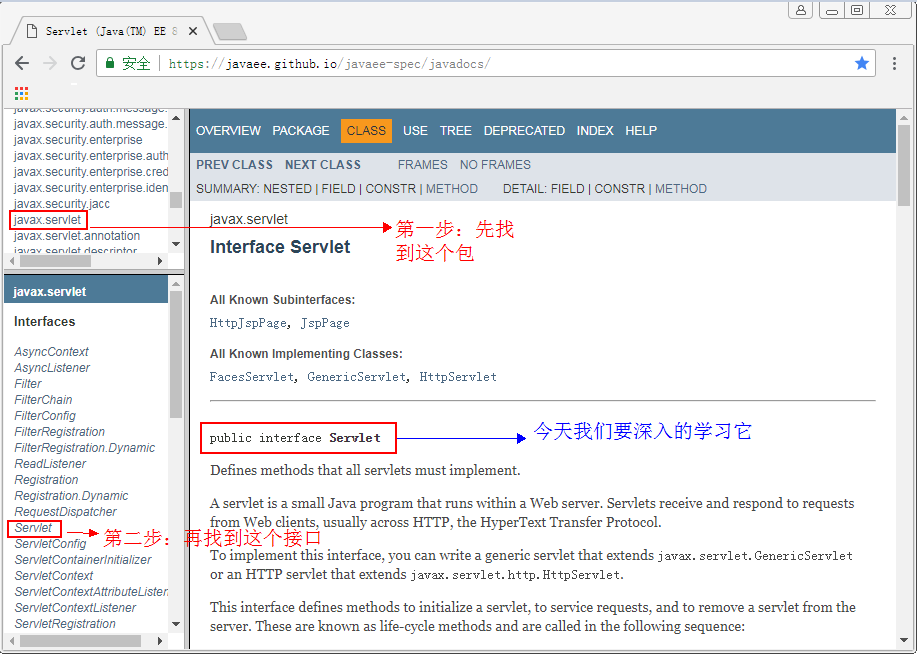

通过阅读API，我们得到如下信息：

第一：Servlet是一个运行在web服务端的java小程序

第二：它可以用于接收和响应客户端的请求

第三：要想实现Servlet功能，可以实现Servlet接口，继承GenericServlet或者HttpServlet

第四：每次请求都会执行service方法

第五：Servlet还支持配置

具体请看下图：

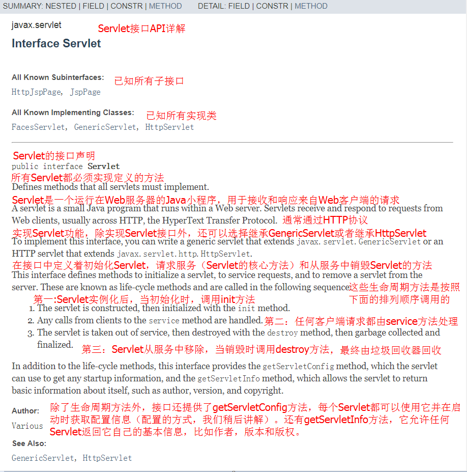

## 1.2 Servlet入门

### 1.2.1 Servlet编码步骤

#### 1）编码步骤

**第一步：前期准备-创建JavaWeb工程**

**第二步：编写一个普通类继承GenericServlet并重写service方法**

**第三步：在web.xml配置Servlet**

#### 2）测试

**在Tomcat中部署项目**

**在浏览器访问Servlet**


### 1.2.2 Servlet执行过程分析

我们通过浏览器发送请求，请求首先到达Tomcat服务器，由服务器解析请求URL，然后在部署的应用列表中找到我们的应用。接下来，在我们的应用中找应用里的web.xml配置文件，在web.xml中找到FirstServlet的配置，找到后执行service方法，最后由FirstServlet响应客户浏览器。整个过程如下图所示：


一句话总结执行过程：

浏览器——>Tomcat服务器——>我们的应用——>应用中的web.xml——>FirstServlet——>响应浏览器

### 1.2.3 Servlet类视图

在《Tomcat和Http协议》这天课程和刚才的入门案例中，我们都定义了自己的Servlet，实现的方式都是选择继承GenericServlet，在Servlet的API介绍中，它提出了我们除了继承GenericServlet外还可以继承HttpServlet，通过查阅servlet的类视图，我们看到GenericServlet还有一个子类HttpServlet。同时，在service方法中还有参数ServletRequest和ServletResponse，它们的关系如下图所示：

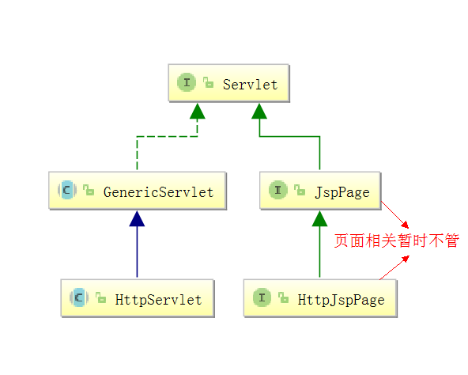

### 1.2.4 Servlet编写方式

#### 1）编写方式说明

我们在实现Servlet功能时，可以选择以下三种方式：

第一种：实现Servlet接口，接口中的方法必须全部实现。

​			  使用此种方式，表示接口中的所有方法在需求方面都有重写的必要。此种方式支持最大程度的自定义。

第二种：继承GenericServlet，service方法必须重写，其他方可根据需求，选择性重写。

​			  使用此种方式，表示只在接收和响应客户端请求这方面有重写的需求，而其他方法可根据实际需求选择性重写，使我们的开发Servlet变得简单。但是，此种方式是和HTTP协议无关的。

第三种：继承HttpServlet，它是javax.servlet.http包下的一个抽象类，是GenericServlet的子类。<b><font color='red'>如果我们选择继承HttpServlet时，只需要重写doGet和doPost方法，不要覆盖service方法。</font></b>

​				使用此种方式，表示我们的请求和响应需要和HTTP协议相关。也就是说，我们是通过HTTP协议来访问的。那么每次请求和响应都符合HTTP协议的规范。请求的方式就是HTTP协议所支持的方式（目前我们只知道GET和POST，而实际HTTP协议支持7种请求方式，GET POST PUT DELETE TRACE OPTIONS HEAD )。

#### 2）HttpServlet的使用细节

**第一步：在入门案例的工程中创建一个Servlet继承HttpServlet**

<font color='red'>注意：不要重写任何方法</font>，如下图所示：


**第二步：部署项目并测试访问**

当我们在地址栏输入ServletDemo2的访问URL时，出现了访问错误，状态码是405。提示信息是：<font style='color:red'>方法不允许。</font>

**第三步：分析原因** 

得出HttpServlet的使用结论：

​	 <b><font color='red'>我们继承了HttpServlet，需要重写里面的doGet和doPost方法来接收get方式和post方式的请求。</font></b>

为了实现代码的可重用性，我们只需要在doGet或者doPost方法中一个里面提供具体功能即可，而另外的那个方法只需要调用提供了功能的方法。

## 1.3 Servlet使用细节

### 1.3.1 Servlet的生命周期

对象的生命周期，就是对象从生到死的过程，即：出生——活着——死亡。用更偏向 于开发的官方说法就是对象创建到销毁的过程。

出生：请求第一次到达Servlet时，对象就创建出来，并且初始化成功。只出生一次，就放到内存中。

活着：服务器提供服务的整个过程中，该对象一直存在，每次只是执行service方法。

死亡：当服务停止时，或者服务器宕机时，对象消亡。

通过分析Servlet的生命周期我们发现，它的实例化和初始化只会在请求第一次到达Servlet时执行，而销毁只会在Tomcat服务器停止时执行，由此我们得出一个结论，Servlet对象只会创建一次，销毁一次。所以，Servlet对象只有一个实例。如果一个对象实例在应用中是唯一的存在，那么我们就说它是单实例的，即运用了单例模式。

### 1.3.2 Servlet的线程安全

由于Servlet运用了单例模式，即整个应用中只有一个实例对象，所以我们需要分析这个唯一的实例中的类成员是否线程安全。接下来，我们来看下面的的示例：

```java
/*
    Servlet线程安全
 */
public class ServletDemo04 extends HttpServlet{
    //1.定义用户名成员变量
    //private String username = null;

    @Override
    protected void doGet(HttpServletRequest req, HttpServletResponse resp) throws ServletException, IOException {
        String username = null;
        //synchronized (this) {
            //2.获取用户名
            username = req.getParameter("username");

            try {
                Thread.sleep(3000);
            } catch (InterruptedException e) {
                e.printStackTrace();
            }

            //3.获取输出流对象
            PrintWriter pw = resp.getWriter();

            //4.响应给客户端浏览器
            pw.print("welcome:" + username);

            //5.关流
            pw.close();
        //}
    }

    @Override
    protected void doPost(HttpServletRequest req, HttpServletResponse resp) throws ServletException, IOException {
        doGet(req,resp);
    }
}
```

启动两个浏览器，输入不同的参数，访问之后发现输出的结果都是一样，所以出现线程安全问题

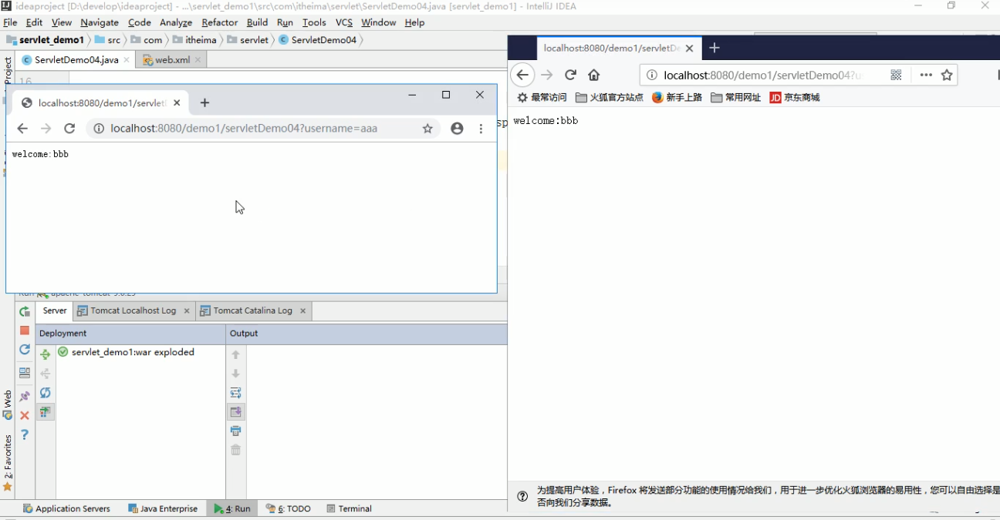

通过上面的测试我们发现，在Servlet中定义了类成员之后，多个浏览器都会共享类成员的数据。其实每一个浏览器端发送请求，就代表是一个线程，那么多个浏览器就是多个线程，所以测试的结果说明了多个线程会共享Servlet类成员中的数据，其中任何一个线程修改了数据，都会影响其他线程。因此，我们可以认为Servlet它不是线程安全的。

分析产生这个问题的根本原因，其实就是因为Servlet是单例，单例对象的类成员只会随类实例化时初始化一次，之后的操作都是改变，而不会重新初始化。

解决这个问题也非常简单，就是在Servlet中定义类成员要慎重。如果类成员是共用的，并且只会在初始化时赋值，其余时间都是获取的话，那么是没问题。如果类成员并非共用，或者每次使用都有可能对其赋值，那么就要考虑线程安全问题了，把它定义到doGet或者doPost方法里面去就可以了。

### 1.3.3 Servlet的注意事项

#### 1）映射Servlet的细节

Servlet支持三种映射方式，以达到灵活配置的目的。

首先编写一个Servlet，代码如下：

```java
/**
 * 演示Servlet的映射方式
 * @author 黑马程序员
 * @Company http://www.itheima.com
 */
public class ServletDemo5 extends HttpServlet {

    /**
     * doGet方法输出一句话
     * @param req
     * @param resp
     * @throws ServletException
     * @throws IOException
     */
    @Override
    protected void doGet(HttpServletRequest req, HttpServletResponse resp) throws ServletException, IOException {
        System.out.println("ServletDemo5接收到了请求");
    }

    /**
     * 调用doGet方法
     * @param req
     * @param resp
     * @throws ServletException
     * @throws IOException
     */
    @Override
    protected void doPost(HttpServletRequest req, HttpServletResponse resp) throws ServletException, IOException {
        doGet(req,resp);
    }
}
```

**第一种：指名道姓的方式**

​			   此种方式，只有和映射配置一模一样时，Servlet才会接收和响应来自客户端的请求。

​			   例如：映射为：/servletDemo5

​						   访问URL：http://localhost:8585/servlet_demo/servletDemo5


**第二种：/开头+通配符的方式**

​			   此种方式，只要符合目录结构即可，不用考虑结尾是什么。

​				例如：映射为：/servlet/*

​							访问URL：http://localhost:8585/servlet/itheima

​											   http://localhost:8585/servlet/itcast.do

​							这两个URL都可以。因为用的*，表示/servlet/后面的内容是什么都可以。

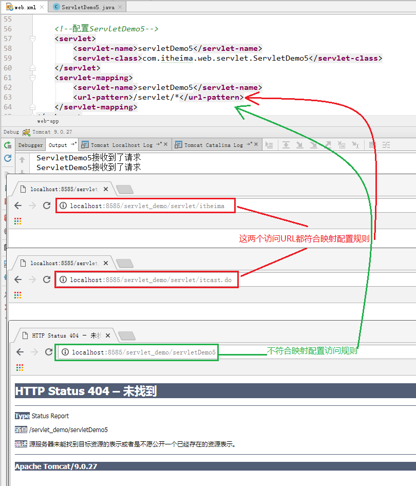

**第三种：通配符+固定格式结尾**

​				此种方式，只要符合固定结尾格式即可，其前面的访问URI无须关心（注意协议，主机和端口必须正确）

​				例如：映射为：*.do

​							访问URL：http://localhost:8585/servlet/itcast.do

​												http://localhost:8585/itheima.do

​							这两个URL都可以方法。因为都是以.do作为结尾，而前面用*号通配符配置的映射，所有无须关心。

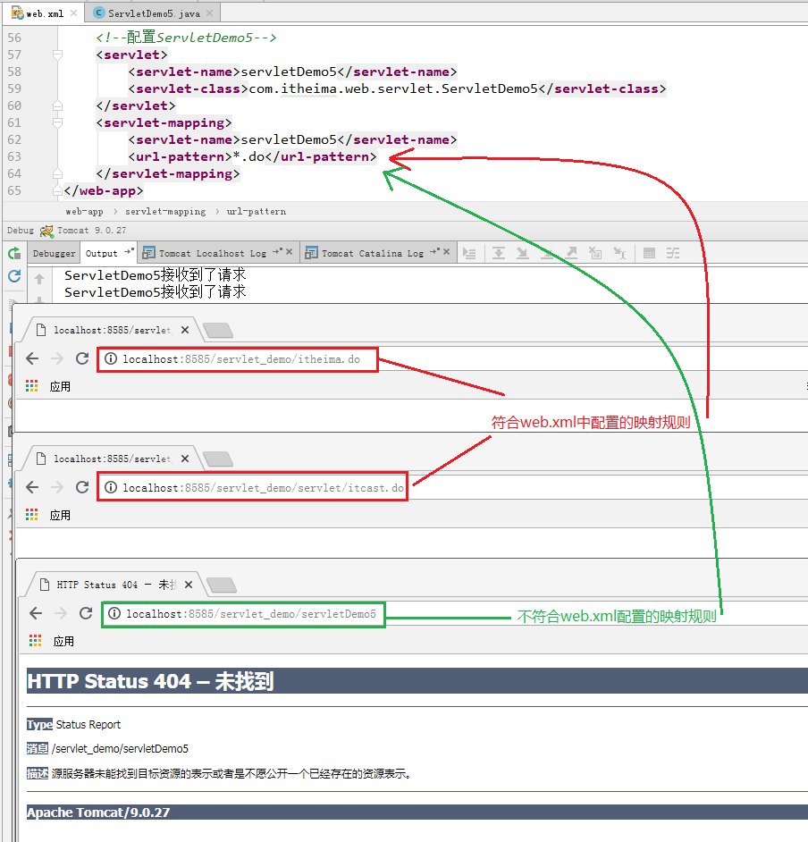

通过测试我们发现，Servlet支持多种配置方式，但是由此也引出了一个问题，当有两个及以上的Servlet映射都符合请求URL时，由谁来响应呢？注意：HTTP协议的特征是一请求一响应的规则。那么有一个请求，必然有且只有一个响应。所以，我们接下来明确一下，多种映射规则的优先级。

先说结论：指名道姓的方式优先级最高，带有通配符的映射方式，有/的比没/的优先级高

所以，我们前面讲解的三种映射方式的优先级为：第一种>第二种>第三种。

演示代码如下：

```java
/**
 * 它和ServletDemo5组合演示Servlet的访问优先级问题
 * @author 黑马程序员
 * @Company http://www.itheima.com
 */
public class ServletDemo6 extends HttpServlet {

    /**
     * doGet方法输出一句话
     * @param req
     * @param resp
     * @throws ServletException
     * @throws IOException
     */
    @Override
    protected void doGet(HttpServletRequest req, HttpServletResponse resp) throws ServletException, IOException {
        System.out.println("ServletDemo6接收到了请求");
    }

    /**
     * 调用doGet方法
     * @param req
     * @param resp
     * @throws ServletException
     * @throws IOException
     */
    @Override
    protected void doPost(HttpServletRequest req, HttpServletResponse resp) throws ServletException, IOException {
        doGet(req,resp);
    }
}
```

```xml
<!--配置ServletDemo6-->
<servlet>
    <servlet-name>servletDemo6</servlet-name>
    <servlet-class>com.itheima.web.servlet.ServletDemo6</servlet-class>
</servlet>
<servlet-mapping>
    <servlet-name>servletDemo6</servlet-name>
    <url-pattern>/*</url-pattern>
</servlet-mapping>
```

运行结果如下：

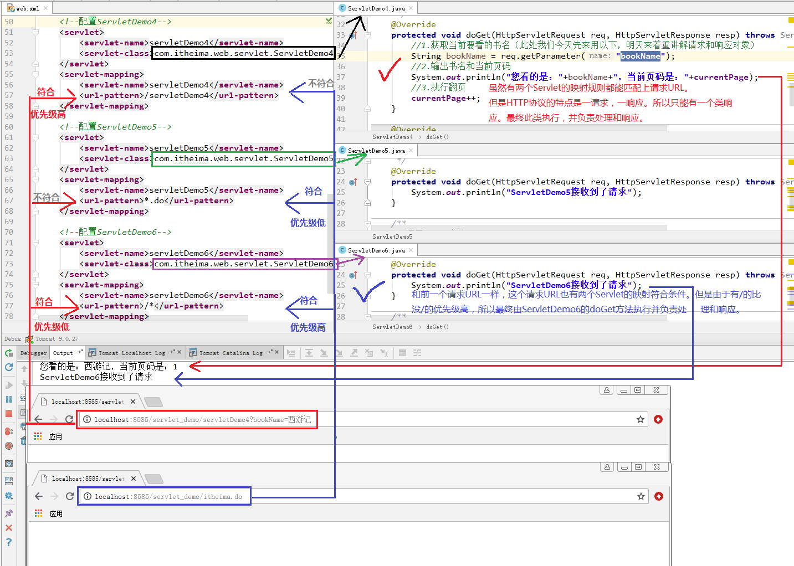

#### 2）多路径映射Servlet

上一小节我们讲解了Servlet的多种映射方式，这一小节我们来介绍一下，一个Servlet的多种路径配置的支持。

它其实就是给一个Servlet配置多个访问映射，从而可以根据不同请求URL实现不同的功能。

首先，创建一个Servlet：

```java
/**
 * 演示Servlet的多路径映射
 * @author 黑马程序员
 * @Company http://www.itheima.com
 */
public class ServletDemo7 extends HttpServlet {

    /**
     * 根据不同的请求URL，做不同的处理规则
     * @param req
     * @param resp
     * @throws ServletException
     * @throws IOException
     */
    @Override
    protected void doGet(HttpServletRequest req, HttpServletResponse resp) throws ServletException, IOException {
        //1.获取当前请求的URI
        String uri = req.getRequestURI();
        uri = uri.substring(uri.lastIndexOf("/"),uri.length());
        //2.判断是1号请求还是2号请求
        if("/servletDemo7".equals(uri)){
            System.out.println("ServletDemo7执行1号请求的业务逻辑：商品单价7折显示");
        }else if("/demo7".equals(uri)){
            System.out.println("ServletDemo7执行2号请求的业务逻辑：商品单价8折显示");
        }else {
            System.out.println("ServletDemo7执行基本业务逻辑：商品单价原价显示");
        }
    }

    /**
     * 调用doGet方法
     * @param req
     * @param resp
     * @throws ServletException
     * @throws IOException
     */
    @Override
    protected void doPost(HttpServletRequest req, HttpServletResponse resp) throws ServletException, IOException {
        doGet(req,resp);
    }
}
```

接下来，在web.xml配置Servlet：

```xml
<!--配置ServletDemo7-->
<servlet>
    <servlet-name>servletDemo7</servlet-name>
    <servlet-class>com.itheima.web.servlet.ServletDemo7</servlet-class>
</servlet>
<!--映射路径1-->
<servlet-mapping>
    <servlet-name>servletDemo7</servlet-name>
    <url-pattern>/demo7</url-pattern>
</servlet-mapping>
<!--映射路径2-->
<servlet-mapping>
    <servlet-name>servletDemo7</servlet-name>
    <url-pattern>/servletDemo7</url-pattern>
</servlet-mapping>
<!--映射路径3-->
<servlet-mapping>
    <servlet-name>servletDemo7</servlet-name>
    <url-pattern>/servlet/*</url-pattern>
</servlet-mapping>
```

最后，启动服务测试运行结果：

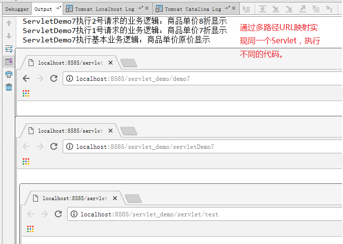

#### 3）启动时创建Servlet

我们前面讲解了Servlet的生命周期，Servlet的创建默认情况下是请求第一次到达Servlet时创建的。但是我们都知道，Servlet是单例的，也就是说在应用中只有唯一的一个实例，所以在Tomcat启动加载应用的时候就创建也是一个很好的选择。那么两者有什么区别呢？

- 第一种：应用加载时创建Servlet，它的优势是在服务器启动时，就把需要的对象都创建完成了，从而在使用的时候减少了创建对象的时间，提高了首次执行的效率。它的弊端也同样明显，因为在应用加载时就创建了Servlet对象，因此，导致内存中充斥着大量用不上的Servlet对象，造成了内存的浪费。
- 第二种：请求第一次访问是创建Servlet，它的优势就是减少了对服务器内存的浪费，因为那些一直没有被访问过的Servlet对象都没有创建，因此也提高了服务器的启动时间。而它的弊端就是，如果有一些要在应用加载时就做的初始化操作，它都没法完成，从而要考虑其他技术实现。

通过上面的描述，相信同学们都能分析得出何时采用第一种方式，何时采用第二种方式。就是当需要在应用加载就要完成一些工作时，就需要选择第一种方式。当有很多Servlet的使用时机并不确定是，就选择第二种方式。

在web.xml中是支持对Servlet的创建时机进行配置的，配置的方式如下：我们就以ServletDemo3为例。

```xml
<!--配置ServletDemo3-->
<servlet>
    <servlet-name>servletDemo3</servlet-name>
    <servlet-class>com.itheima.web.servlet.ServletDemo3</servlet-class>
    <!--配置Servlet的创建顺序，当配置此标签时，Servlet就会改为应用加载时创建
        配置项的取值只能是正整数（包括0），数值越小，表明创建的优先级越高
    -->
    <load-on-startup>1</load-on-startup>
</servlet>
<servlet-mapping>
    <servlet-name>servletDemo3</servlet-name>
    <url-pattern>/servletDemo3</url-pattern>
</servlet-mapping>
```


#### 4）默认Servlet

默认Servlet是由服务器提供的一个Servlet，它配置在Tomcat的conf目录下的web.xml中。如下图所示：

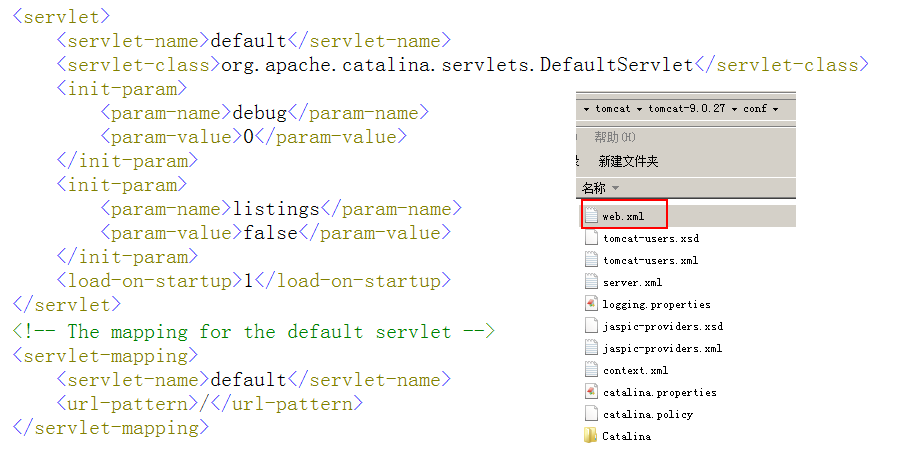

它的映射路径是<b><font color='red'>`<url-pattern>/<url-pattern>`</font></b>，我们在发送请求时，首先会在我们应用中的web.xml中查找映射配置，找到就执行，这块没有问题。但是当找不到对应的Servlet路径时，就去找默认的Servlet，由默认Servlet处理。所以，一切都是Servlet。

### 1.4 Servlet关系总图

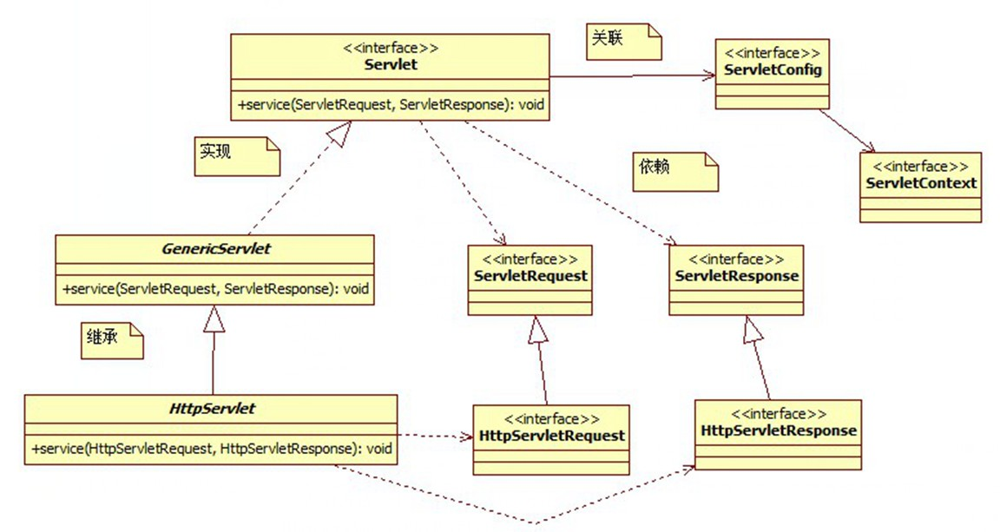

# 2 ServletConfig

## 2.1 ServletConfig概述

### 2.1.1 基本概念

它是Servlet的配置参数对象，在Servlet规范中，允许为每个Servlet都提供一些初始化配置。所以，每个Servlet都一个自己的ServletConfig。它的作用是在Servlet初始化期间，把一些配置信息传递给Servlet。

### 2.1.2 生命周期

由于它是在初始化阶段读取了web.xml中为Servlet准备的初始化配置，并把配置信息传递给Servlet，所以生命周期与Servlet相同。这里需要注意的是，如果Servlet配置了`<load-on-startup>1</load-on-startup>`，那么ServletConfig也会在应用加载时创建。

## 2.2 ServletConfig的使用

### 2.2.1 如何获取

首先，我们要清楚的认识到，它可以为每个Servlet都提供初始化参数，所以肯定可以在每个Servlet中都配置。那是配置在Servlet的声明部分，还是映射部分呢？我们接下来先准备一个Servlet，然后给同学们揭秘。

```java
/**
 * 演示Servlet的初始化参数对象
 * @author 黑马程序员
 * @Company http://www.itheima.com
 */
public class ServletDemo8 extends HttpServlet {

    //定义Servlet配置对象ServletConfig
    private ServletConfig servletConfig;

    /**
     * 在初始化时为ServletConfig赋值
     * @param config
     * @throws ServletException
     */
    @Override
    public void init(ServletConfig config) throws ServletException {
        this.servletConfig = config;
    }

    /**
     * @param req
     * @param resp
     * @throws ServletException
     * @throws IOException
     */
    @Override
    protected void doGet(HttpServletRequest req, HttpServletResponse resp) throws ServletException, IOException {
        //输出ServletConfig
        System.out.println(servletConfig);
    }

    /**
     * 调用doGet方法
     * @param req
     * @param resp
     * @throws ServletException
     * @throws IOException
     */
    @Override
    protected void doPost(HttpServletRequest req, HttpServletResponse resp) throws ServletException, IOException {
        doGet(req,resp);
    }
}
```

```xml
<!--配置ServletDemo8-->
<servlet>
    <servlet-name>servletDemo8</servlet-name>
    <servlet-class>com.itheima.web.servlet.ServletDemo8</servlet-class>
</servlet>
<servlet-mapping>
    <servlet-name>servletDemo8</servlet-name>
    <url-pattern>/servletDemo8</url-pattern>
</servlet-mapping>
```

### 2.2.2 如何配置

在上一小节中，我们已经准备好了Servlet，同时也获取到了它的ServletConfig对象，在本小节中我们将告诉同学们如何配置初始化参数，它需要使用`<servlet>`标签中的`<init-param>`标签来配置。这也就揭秘上一小节的悬念，Servlet的初始化参数都是配置在Servlet的声明部分的。并且每个Servlet都支持有多个初始化参数，并且初始化参数都是以键值对的形式存在的。接下来，我们看配置示例：

```xml
<!--配置ServletDemo8-->
<servlet>
    <servlet-name>servletDemo8</servlet-name>
    <servlet-class>com.itheima.web.servlet.ServletDemo8</servlet-class>
    <!--配置初始化参数-->
    <init-param>
        <!--用于获取初始化参数的key-->
        <param-name>encoding</param-name>
        <!--初始化参数的值-->
        <param-value>UTF-8</param-value>
    </init-param>
    <!--每个初始化参数都需要用到init-param标签-->
    <init-param>
        <param-name>servletInfo</param-name>
        <param-value>This is Demo8</param-value>
    </init-param>
</servlet>
<servlet-mapping>
    <servlet-name>servletDemo8</servlet-name>
    <url-pattern>/servletDemo8</url-pattern>
</servlet-mapping>
```

### 2.2.3 常用方法

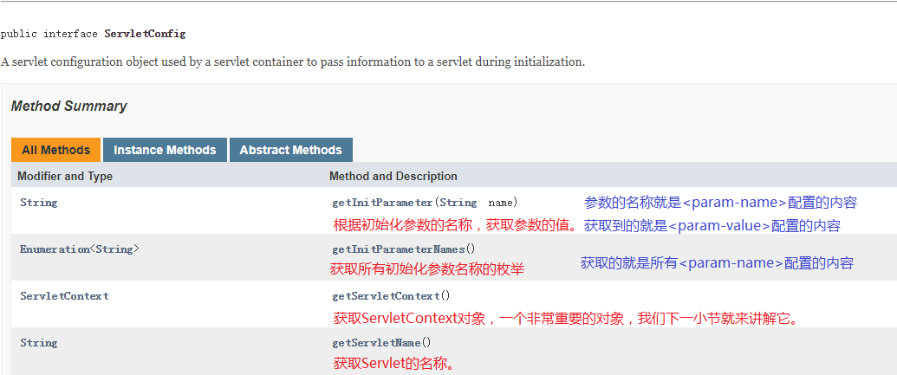

```java
/**
 * 演示Servlet的初始化参数对象
 * @author 黑马程序员
 * @Company http://www.itheima.com
 */
public class ServletDemo8 extends HttpServlet {

    //定义Servlet配置对象ServletConfig
    private ServletConfig servletConfig;

    /**
     * 在初始化时为ServletConfig赋值
     * @param config
     * @throws ServletException
     */
    @Override
    public void init(ServletConfig config) throws ServletException {
        this.servletConfig = config;
    }

    /**
     * doGet方法输出一句话
     * @param req
     * @param resp
     * @throws ServletException
     * @throws IOException
     */
    @Override
    protected void doGet(HttpServletRequest req, HttpServletResponse resp) throws ServletException, IOException {
        //1.输出ServletConfig
        System.out.println(servletConfig);
        //2.获取Servlet的名称
        String servletName= servletConfig.getServletName();
        System.out.println(servletName);
        //3.获取字符集编码
        String encoding = servletConfig.getInitParameter("encoding");
        System.out.println(encoding);
        //4.获取所有初始化参数名称的枚举
        Enumeration<String> names = servletConfig.getInitParameterNames();
        //遍历names
        while(names.hasMoreElements()){
            //取出每个name
            String name = names.nextElement();
            //根据key获取value
            String value = servletConfig.getInitParameter(name);
            System.out.println("name:"+name+",value:"+value);
        }
        //5.获取ServletContext对象
        ServletContext servletContext = servletConfig.getServletContext();
        System.out.println(servletContext);
    }

    /**
     * 调用doGet方法
     * @param req
     * @param resp
     * @throws ServletException
     * @throws IOException
     */
    @Override
    protected void doPost(HttpServletRequest req, HttpServletResponse resp) throws ServletException, IOException {
        doGet(req,resp);
    }
}
```


# 3 ServletContext

## 3.1 ServletContext概述

### 3.1.1 基本介绍

ServletContext对象，它是应用上下文对象。每一个应用有且只有一个ServletContext对象。它可以实现让应用中所有Servlet间的数据共享。 

### 3.1.2 生命周期

出生——活着——死亡

出生： 应用一加载，该对象就被创建出来了。一个应用只有一个实例对象。(Servlet和ServletContext都是单例的)

活着：只要应用一直提供服务，该对象就一直存在。

死亡：应用被卸载（或者服务器挂了），该对象消亡。

### 3.1.3 域对象概念

域对象的概念，它指的是对象有作用域，即有作用范围。

域对象的作用，域对象可以实现数据共享。不同作用范围的域对象，共享数据的能力不一样。

在Servlet规范中，一共有4个域对象。今天我们讲解的ServletContext就是其中一个。它也是我们接触的第一个域对象。它是web应用中最大的作用域，叫application域。每个应用只有一个application域。它可以实现整个应用间的数据共享功能。

## 3.2 ServletContext的使用

### 3.2 1 ServletContext介绍

```
ServletContext 是应用上下文对象。每一个应用中只有一个 ServletContext 对象。
作用：可以获得应用的全局初始化参数和达到 Servlet 之间的数据共享。
生命周期：应用一加载则创建，应用被停止则销毁。
```

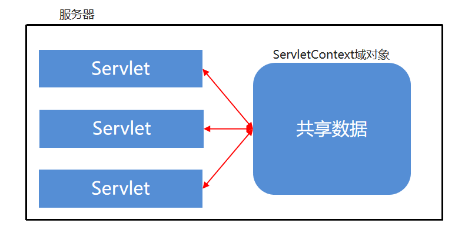

### 3.2.2 域对象

```
域对象指的是对象有作用域。也就是有作用范围。域对象可以实现数据的共享。不同作用范围的域对象，共享数据的能力也不一样。

在 Servlet 规范中，一共有 4 个域对象。ServletContext 就是其中的一个。它也是 web 应用中最大的作用域，也叫 application 域。它可以实现整个应用之间的数据共享！
```


### 3.2.3 ServletContext配置

ServletContext既然被称之为应用上下文对象，所以它的配置是针对整个应用的配置，而非某个特定Servlet的配置。它的配置被称为应用的初始化参数配置。

配置的方式，需要在`<web-app>`标签中使用`<context-param>`来配置初始化参数。具体代码如下：

```xml
<!--配置应用初始化参数-->
<context-param>
    <!--用于获取初始化参数的key-->
    <param-name>servletContextInfo</param-name>
    <!--初始化参数的值-->
    <param-value>This is application scope</param-value>
</context-param>
<!--每个应用初始化参数都需要用到context-param标签-->
<context-param>
    <param-name>globalEncoding</param-name>
    <param-value>UTF-8</param-value>
</context-param>
```

### 3.2.4 ServletContext常用方法

```java
public class ServletContextDemo extends HttpServlet {
    @Override
    protected void doGet(HttpServletRequest req, HttpServletResponse resp) throws ServletException, IOException {
        //获取ServletContext对象
        ServletContext context = getServletContext();

        //获取全局配置的globalEncoding
        String value = context.getInitParameter("globalEncoding");
        System.out.println(value);

        //获取应用的访问虚拟目录
        String contextPath = context.getContextPath();
        System.out.println(contextPath);

        //根据虚拟目录获取应用部署的磁盘绝对路径
        //获取b.txt文件的绝对路径
        String b = context.getRealPath("/b.txt");
        System.out.println(b);

        //获取c.txt文件的绝对路径
        String c = context.getRealPath("/WEB-INF/c.txt");
        System.out.println(c);

        //获取a.txt文件的绝对路径
        String a = context.getRealPath("/WEB-INF/classes/a.txt");
        System.out.println(a);


        //向域对象中存储数据
        context.setAttribute("username","zhangsan");

        //移除域对象中username的数据
        //context.removeAttribute("username");
    }

    @Override
    protected void doPost(HttpServletRequest req, HttpServletResponse resp) throws ServletException, IOException {
        doGet(req,resp);
    }
}
```


# 4 注解开发Servlet

## 4.1 Servlet3.0规范

首先，我们要先跟同学们明确一件事情，我们在《Tomcat和HTTP协议》课程中已经介绍了，我们使用的是Tomcat9，JavaEE规范要求是8，对应的Servlet规范规范应该是JavaEE8包含的4.x版本。

但是，同学们要知道，在企业级应用的开发中，稳定远比追新版本重要的多。所以，我们虽然用到了Tomcat9和对应的JavaEE8，但是涉及的Servlet规范我们降板使用，用的是Servlet3.1版本。关于兼容性问题，同学们也无须担心，向下兼容的特性，在这里也依然适用。

接下来，同学还有可能疑惑的地方就是，我们课程中明明使用的是Servlet3.1版本的规范，但是却总听老师提Servlet3.0规范，这两个到底有怎样的联系呢？

现在就给同学们解惑，在大概十多年前，那会还是Servlet2.5的版本的天下，它最明显的特征就是Servlet的配置要求配在web.xml中，<b><font color='red'>我们今天课程中在第4章节《注解开发Servlet》之前，全都是基于Servlet2.5规范编写的。</font></b>从2007年开始到2009年底，在这个时间段，软件开发开始逐步的演变，基于注解的配置理念开始逐渐出现，大量注解配置思想开始用于各种框架的设计中，例如：Spring3.0版本的Java Based Configuration，JPA规范，apache旗下的struts2和mybatis的注解配置开发等等。

JavaEE6规范也是在这个期间设计并推出的，与之对应就是它里面包含了新的Servlet规范：<b><font color='red'>Servlet3.0版本！</font></b>

## 4.2 注解开发入门案例

### 4.2.1 自动注解配置

#### 1）配置步骤

**第一步：创建JavaWeb工程，并移除web.xml**


**第二步：编写Servlet**

```java
/**
 * 注解开发Servlet
 * @author 黑马程序员
 * @Company http://www.itheima.com
 */
public class ServletDemo1 extends HttpServlet {

    @Override
    protected void doGet(HttpServletRequest req, HttpServletResponse resp) throws ServletException, IOException {
        doPost(req,resp);
    }

    @Override
    protected void doPost(HttpServletRequest req, HttpServletResponse resp) throws ServletException, IOException {
        System.out.println("Servlet Demo1 Annotation");
    }
}
```

**第三步：使用注解配置Servlet**

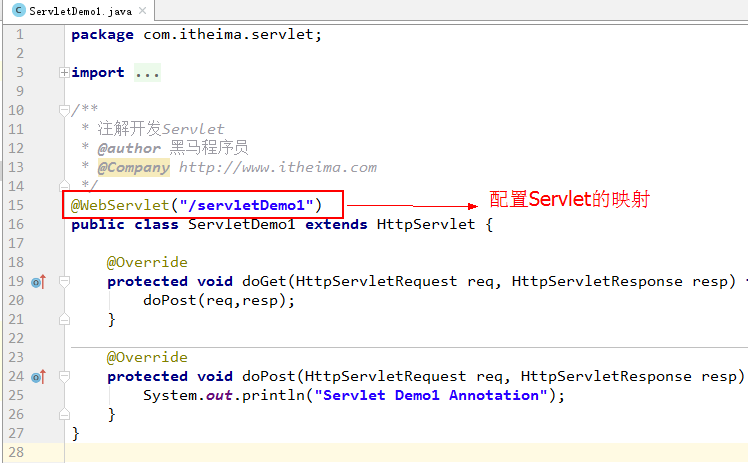

**第四步：测试**

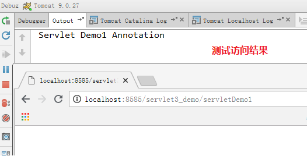

#### 2）注解详解

```java
/**
 * WebServlet注解
 * @since Servlet 3.0 (Section 8.1.1)
 */
@Target(ElementType.TYPE)
@Retention(RetentionPolicy.RUNTIME)
@Documented
public @interface WebServlet {

    /**
     * 指定Servlet的名称。
     * 相当于xml配置中<servlet>标签下的<servlet-name>
     */
    String name() default "";

    /**
     * 用于映射Servlet访问的url映射
     * 相当于xml配置时的<url-pattern>
     */
    String[] value() default {};

    /**
     * 相当于xml配置时的<url-pattern>
     */
    String[] urlPatterns() default {};

    /**
     * 用于配置Servlet的启动时机
     * 相当于xml配置的<load-on-startup>
     */
    int loadOnStartup() default -1;

    /**
     * 用于配置Servlet的初始化参数
     * 相当于xml配置的<init-param>
     */
    WebInitParam[] initParams() default {};

    /**
     * 用于配置Servlet是否支持异步
     * 相当于xml配置的<async-supported>
     */
    boolean asyncSupported() default false;

    /**
     * 用于指定Servlet的小图标
     */
    String smallIcon() default "";

    /**
     * 用于指定Servlet的大图标
     */
    String largeIcon() default "";

    /**
     * 用于指定Servlet的描述信息
     */
    String description() default "";

    /**
     * 用于指定Servlet的显示名称
     */
    String displayName() default "";
}
```

### 4.2.2 手动创建容器

#### 1）前置说明

在使用Servlet3.1版本的规范时，脱离了web.xml进行注解开发，它除了支持使用注解的配置方式外，还支持纯手动创建Servlet容器的方式。要想使用的话，必须遵循它的编写规范。它是从Servlet3.0规范才开始引入的，加入了一个新的接口：

```java
package javax.servlet;

import java.util.Set;

/**
 * 初始化Servlet容器必须实现此接口
 * 它是Servlet3.0规范提供的标准接口
 * @since Servlet 3.0
 */
public interface ServletContainerInitializer {
     /**
     * 启动容器时做一些初始化操作，例如注册Servlet,Filter,Listener等等。
 	 * @since Servlet 3.0
     */
    void onStartup(Set<Class<?>> c, ServletContext ctx) throws ServletException;
}
```

同时可以利用@HandlesTypes注解，把要加载到onStartup方法中的类字节码传入进来，@HandlesTypes源码如下：

```java
/**
 * 用于指定要加载到ServletContainerInitializer接口实现了中的字节码
 * @see javax.servlet.ServletContainerInitializer
 * @since Servlet 3.0
 */
@Target({ElementType.TYPE})
@Retention(RetentionPolicy.RUNTIME)
public @interface HandlesTypes {

    /**
     * 指定要加载到ServletContainerInitializer实现类的onStartUp方法中类的字节码。
     * 字节码可以是接口，抽象类或者普通类。
     */
    Class[] value();
}
```

#### 2）编写步骤

**第一步：创建工程，并移除web.xml**


**第二步：编写Servlet**

```java
/**
 * 注解开发Servlet 之 手动初始化容器
 * @author 黑马程序员
 * @Company http://www.itheima.com
 */
public class ServletDemo1 extends HttpServlet {

    @Override
    protected void doGet(HttpServletRequest req, HttpServletResponse resp) throws ServletException, IOException {
        doPost(req,resp);
    }

    @Override
    protected void doPost(HttpServletRequest req, HttpServletResponse resp) throws ServletException, IOException {
        System.out.println("Servlet Demo1 Annotation manual");
    }
}
```

**第三步：创建初始化容器的类，并按照要求配置**

```java
/**
 * 初始化容器操作
 * @author 黑马程序员
 * @Company http://www.itheima.com
 */
public class MyServletContainerInitializer implements ServletContainerInitializer {

    @Override
    public void onStartup(Set<Class<?>> c, ServletContext ctx) throws ServletException {
       
    }
}
```

在脱离web.xml时，要求在src目录下包含一个META-INF目录，位置和及字母都不能改变，且严格区分大小写。在目录中创建一个名称为`javax.servlet.ServletContainerInitializer`的文件，里面写实现了`ServletContainerInitializer`接口的全限定类名。如下图所示：


**第四步：编写注册Servlet的代码**

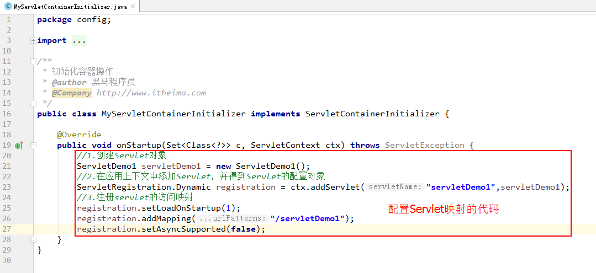

**第五步：测试**


# 5 Servlet应用案例-学生管理系统

## 5.1 案例介绍

### 5.1.1 案例需求

在昨天的课程讲解中，我们用Tomcat服务器替代了SE阶段的学生管理系统中自己写的服务器。今后我们进入企业肯定也会使用成型的产品，而不会自己去写服务器（除非是专门做应用服务器的公司）。

从今天开始案例正式进入了编码阶段，它是延续了JavaSE阶段课程的学生管理系统。并且分析了SE中系统的各类问题，在JavaWeb阶段学习，就是要通过每天的学习，逐步解决SE阶段学生管理系统中的遗留问题。

今天，我们将会去解决下面这个问题：<b><font color='red'>保存学生</font></b>。也就是让数据真正的动起来，本质就是通过html发送一个请求，把表单中填写的数据带到服务器端。因为每个使用者在表单填写的内容不一样，所有最终存起来的也就不一样了。

### 5.1.2 技术选型

这是一个全新的案例，而不是在SE阶段的案例上进行改造。所以我们用项目的方式来去约束这个案例。

任何一个项目，在立项之初都会有技术选型，也就是定义使用的技术集，这里面包含很多。例如：表现层技术，持久层技术，数据库技术等等。

我们今天只针对表现层进行编码，所以就先来定义表现层技术。表现层技术的选型就是Servlet+HTML的组合。

由HTML中编写表单，Servlet中定义接收请求的方法，最终把表单数据输出到控制台即可。<b>我们Servlet的配置方式仍然选择基于web.xml的配置方式。</b>